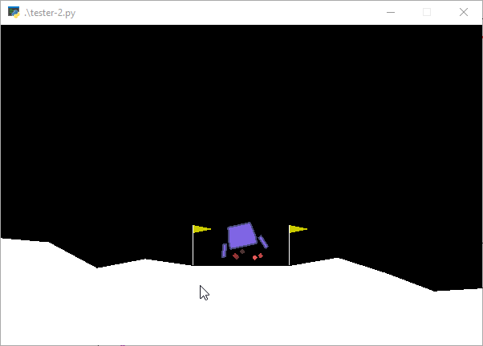
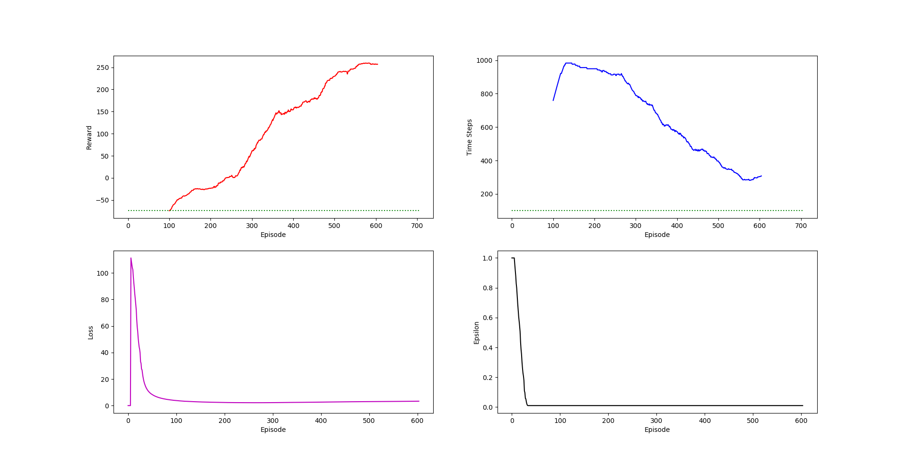

# LunarLander-v2
A Deep Q-Learning Network (DQN) for the [LunarLander-v2 in OpenAI Gym](https://gym.openai.com/envs/LunarLander-v2/).

This code implements the DQN algorithm with experience replay and target network.

## Requirements:
1. [Tensorflow v2](https://www.tensorflow.org/install)
2. `pip install gym`
3. `pip install box2d-py`
4. `pip install matplotlib`

## Training

`python dqn.py`

During the training phase the agent uses an epsilon-greedy policy.

The network weights are saved every 25 episodes.

The below chart shows the moving average of Reward and Time Steps as well as loss values and the decay of epsilon over the episodes.

## Testing

You can test the trained agent once checkpoints and log files are created by changing lines 116 and 117 in [`tester.py`](tester.py).

The current tester code uses the weights of a trained network.

`python tester.py`
